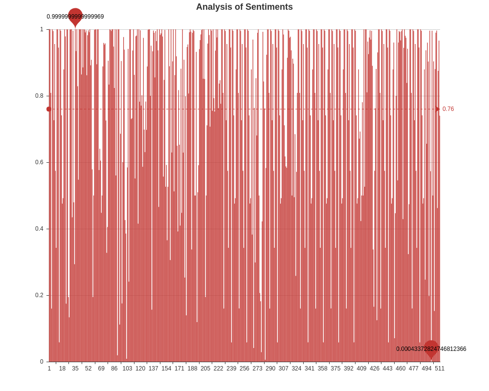
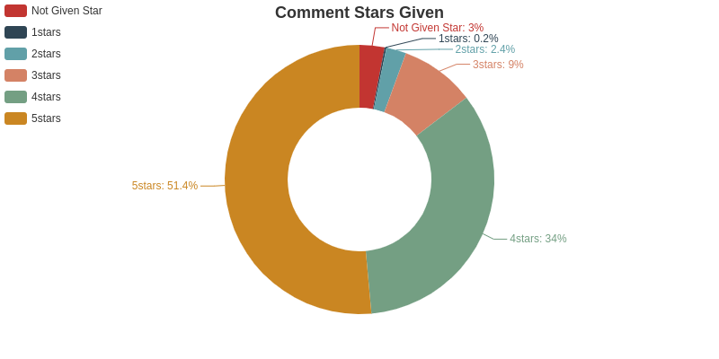
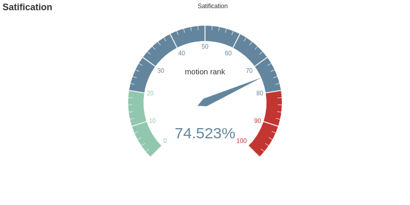

#  介绍
----
1. 爬取豆瓣影评脚本：douban_crawer.py
2. 词云制作脚本：wordcld.py
3. 评论情感分析脚本：motion.py
# 外部依赖
----
建议使用 [Anaconda](https://www.anaconda.com/download/) 集成环境  
针对linux用户：  
- 安装BeautifulSoup爬虫框架
`$ sudo apt-get python3-bs4(python3)`
- 安装[wordcloud](https://github.com/amueller/word_cloud)词云库
`$ pip install wordcloud` ; if using conda , `$ conda install -c conda-forge wordcloud`
- 安装[jieba](https://github.com/fxsjy/jieba)中文分词库
	`$ easy_install jieba` 或者 `$ pip install jieba` 或者 `$ pip3 install jieba`	
- 安装[snownlp](https://github.com/isnowfy/snownlp)中文情感分析库
`pip install snownlp`
- 安装[pyecharts](https://github.com/pyecharts/pyecharts)图形绘制库
(不推荐)`$ pip install pyecharts`，**安装过程中可能存在问题，建议查看简书上的引导[Damon0626](https://www.jianshu.com/p/eaad92f6d9ee)**
# 脚本说明
----
1. douban_crawer.py 中调用main(filmname,url_start)，需要提供电影名称以及影评短评首页URL。  
实验用到的filmname=红辣椒，url_start=https://movie.douban.com/subject/1865703/comments?start=0&limit=20&sort=new_score&status=P
2. douban_crawer.py 中第48行 Login_douban(redir_url) 函数需要填写豆瓣的账户与密码  
```
login_infor = {
            'redir':redir_url,
            'form_email':'input Douban User Login',
            'form_password':'input Douban User Password',
            'login':u'登录'
            }
```
3. douban_crawer.py 在运行过程中，由于多次重复登录豆瓣，可能会遇到验证码验证，脚本采用捕获验证码图片，
储存在./crawed/captcha.jpg路径下。需要人工识别并输入验证码（尽量不要输错，否则多次输入错误会被拒绝访问）。
# 爬去结果文件与评论分析
----
1. 目录crawed下，Comments.json与Comments.txt包含评论的用户名称、评论日期、评论星级、支持人数以及评论内容。
2. 目录analysis下， .html 文件是采用pyecharts库生成的评论分析结果（具有动态效果，下载打开效果更佳哟～）， .png 是评论词云图片。
3. 目录analysis_pic下， .png文件时analysis目录中.html格式的静态图片。  
<center>红辣椒影评词云图</center>

<center>影评情感倾向分析</center>

<center>评论星级占比</center>

<center>影评加权满意度</center>

